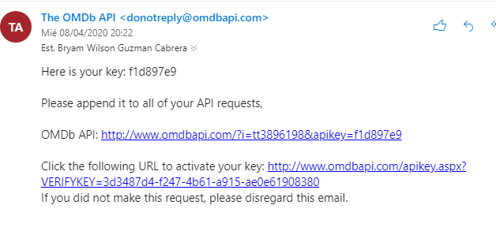

**TÍTULO PRÁCTICA**: Desarrollo de una aplicación web utilizando la API de la base de datos de películas OMDB 
**OBJETIVO ALCANZADO:**  Diseniar un diagrama de arquitectura y patrones adecuado para la plataforma web realizada Interactuar con el api de OMDB y poder representar la en una interfaz realizada en html Realizar las funciones para buscar por nombre y titulo de una pelicula                      
**ACTIVIDADES DESARROLLADAS**                                                                                               

**Creando una llave para acceder** Nos dirigimos a la pagina oficial del Api Omdb <http://www.omdbapi.com/>                 

En **api Key** solicitamos una llave

Ingresamos el correo nombre completo y para que vamos a utilizar esa llave

Recibimos un correo con la llave y la podemos utilizar

**Requisitos aplicación Web**

-   La aplicación Web debe permitir buscar la información de las películas tanto
    por el nombre (listado) como por el código (id) de cada película.

>   **Buscar información por nombre**

>   Para buscar la información por el nombre se ha utilizado el siguiente código

>   \-Ahí tomamos los valores que encuentran en el index,html para poder
>   manipularlos como variables en JavaScript

  var prueba;

    var result = "";

    var porNombre = document.getElementById("titulo").value;

    console.log(porNombre);

    document.getElementById('action').innerHTML = "";

    var intro = document.getElementById('mia');

    intro.style.visibility = "visible";

    var detalles = "";

>   **-**Si la caja de texto no tiene ningún texto entonces la tabla se mostrara
>   como que no hay información acerca eso

   if (porNombre == "") {

        detalles = "\<tr\>" +

            "\<td colspan='5'\> Sin informacion disponible...\</td\>" +

            "\</tr\>";

        document.getElementById("informacion").innerHTML = detalles;

    } 

>   El siguiente método es el que hace todo el trabajo, se realizo un bucle que
>   pase como parámetro la pagina y que vaya obteniendo los datos del 1 al 100,
>   puesto que en la pagina oficial decía que el mínimo es 1 y el máximo 100;
>   esta es la primera parte y la variable data es igual al JSON convertido en
>   texto.

for (i = 1; i \<= 100; i++) {

        // Petición HTTP GET síncrona hacia el archivo fotos.json del servidor

        req.open("GET", "http://www.omdbapi.com/?apikey=eabd474&s=" + porNombre + "&page=" + i, false);

        // Envío de la petición

        req.send(null);

        data = JSON.parse(req.responseText)

        var jj = data.Response;

>   Aquí en esta parte del código se compara a la respuesta del JSON, puesto que
>   este devuelve True si hay información y false si no la hay, entonces si es
>   true, hay información y por lo tanto, se puede añadir a la variable detalles
>   y esta consecuentemente va a ser enviada hacia la tabla que se encuentra en
>   el archivo index

>   En la linea donde se encuentra “buscarPorID(clave)” se pasa como parámetro
>   la clave de la pelicula

if (jj == "True") {

        if (porNombre == "") {

            detalles = "\<tr\>" +

                "\<td colspan='5'\> Sin informacion disponible...\</td\>" +

                "\</tr\>";

            document.getElementById("informacion").innerHTML = detalles;

        } 

 

        else {

            data.Search.forEach(movie =\> {

                detalles += "\<tr\>" +

                    "\<td\>\<a href='\#movies' onclick=\\"buscarPorID('" + movie.imdbID + 

                    "')\\"\>Mas detalles \</td\>" +

                    "\<td\>" + movie.Title + "\</td\>" +

                    "\<td\>" + movie.Year + "\</td\>" +

                    "\<td\>" + movie.Type + "\</td\>" +

                    "\<td\>\" +

                    "\</tr\>";

            });

        }

        document.getElementById("informacion").innerHTML = detalles;

>   Cuando ya devuelve falso para de iterar y se utiliza la función **return**
>   para salir del bucle, pero antes de eso se utilizó el siguiente código para
>   el índice, , entonces cada ve que se elige una película diferente, el incide
>   cambia

 } else {

            \$(document).ready(function () {

                var rowsShown = 5;

                var rowsTotal = \$('\#mia tbody tr').length;

                console.log(\$('\#mia tbody tr').length);

                var numPages = rowsTotal / rowsShown;

                var indices = "";

                for (i = 0; i \< numPages; i++) {

                    var pageNum = i + 1;

                    indices += '\<a href="\#" rel="' + i + '"\>' + pageNum + '\</a\> ';

                };

                document.getElementById('menu').innerHTML = indices;

                \$('\#mia tbody tr').hide();

                \$('\#mia tbody tr').slice(0, rowsShown).show();

                \$('\#menu a:first').addClass('active');

                \$('\#menu a').bind('click', function () {

                    \$('\#menu a').removeClass('active');

                    \$(this).addClass('active');

                    var currPage = \$(this).attr('rel');

                    var startItem = currPage \* rowsShown;

                    var endItem = startItem + rowsShown;

                    \$('\#mia tbody tr').css('opacity', '0.0').hide().slice(startItem, endItem).

                        css('display', 'table-row').animate({ opacity: 1 }, 300);

                });

            });

            return;

        }

Se muestra el índice de acuerdo a la búsqueda de **batman,** esta en la pag 1

Pag 35

Pag 76

**Busqueda por código**

Aqui no necesitamos hacer iteraciones puesto que ya se ha pasado como parámetro
la clave de la película al hacer click anteriormente

Guardamos en diferentes variables la información según sea el caso

Se ha utilizado el motor de plantillas habndlebars para darle un estilo similar
al de la visualización de una película en los sitios web que ofrecen películas
de estreno gratis

Despues de todo, se inserta en la etiqueta **nav** que se encuentra en el
**index.html**

function buscarPorID(clave) {

    var peticion = ""

    var data = ""

    var detalles = ""

    var clave2 = clave

    console.log(clave2)

    peticion = "http://www.omdbapi.com/?apikey=eabd474&i=" + clave2 + "&plot=full"

    req.open("GET", peticion, false);

    // Envío de la petición

    req.send(null);

    var data = JSON.parse(req.responseText);

    var year = data.Year;

    var rated = data.Rated;

    var released = data.Released; 

    var runtime = data.Runtime;    

    var actors = data.Actors;    

    var country = data.Country;

    var director = data.Director;    

    var genre = data.Genre;    

    var language = data.Language;

    var awards =data.Awards;

    var plot = data.Plot;    

    var poster = data.Poster;    

    var production = data.Production;

    var type = data.Type;

    var template = document.getElementById('index').innerHTML;

    var compile = Handlebars.compile(template);

    var compiledHTML = compile({

        name: \`\${data.Title}\`,

        poster: \`\${data.Poster}\`,

        rated: \`Clasificacion: \<strong\>\${data.Rated}\</strong\>\`,

        year: \`Fecha de lanzamiento : \<strong\>\${data.Released}\</strong\>\`,

        runtime: \`Duracion: \<strong\>\${data.Runtime}\</strong\>\`,

        genre: \`Genero: \<strong\>\${data.Genre}\</strong\>\`,

        director: \`Director: \<strong\>\${data.Director}\</strong\>\`,

        actors: \`Actores: \<strong\>\${data.Actors}\</strong\>\`,

        country: \`Ciudad(es): \<strong\>\${data.Country}\</strong\>\`,

        language: \`Idioma(s): \<strong\>\${data.Language}\</strong\>\`,

        awards: \`Premio(s): \<strong\>\${data.Awards}\</strong\>\`,

        production: \`Produccion: \<strong\>\${data.Production}\</strong\>\`,

        type: \`Tipo: \<strong\>\${data.Type}\</strong\>\`,

        plot: \`\<strong\>Sinopsis:\</strong\> \${data.Plot}\`,

    });

    document.getElementById('action').innerHTML = compiledHTML;

}

Se ha seleccionado la película de **Batman Begins**

-   **Además, se deberá visualizar toda la información disponible (plot=full) de
    la base de datos de películas. También, la aplicación deberá presentar un
    máximo de 5 películas por búsqueda. Es decir, si la búsqueda retorna más de
    5 películas se deberá paginar los resultados.**

El proceso de la información disponible ya se ha explicado anteriormente, para
la paginación de 5 películas se ha utilizado el siguiente código

Se toma la longitud de la tabla y se divide para 5, entonces nos da un numero
total de paginas que vamos a obtener

Luego con un bucle for vamos añadiendo a una variable denominada **indices** y
cuando termina el bucle, insertamos esta variable en una etiqueta **nav**

Luego con las siguientes líneas de código se le da el formato correspondiente
para la navegación de paginas

  \$(document).ready(function () {

                var rowsShown = 5;

                var rowsTotal = \$('\#mia tbody tr').length;

                console.log(\$('\#mia tbody tr').length);

                var numPages = rowsTotal / rowsShown;

                var indices = "";

                for (i = 0; i \< numPages; i++) {

                    var pageNum = i + 1;

                    indices += '\<a href="\#" rel="' + i + '"\>' + pageNum + '\</a\> ';

                };

                document.getElementById('menu').innerHTML = indices;

                \$('\#mia tbody tr').hide();

                \$('\#mia tbody tr').slice(0, rowsShown).show();

                \$('\#menu a:first').addClass('active');

                \$('\#menu a').bind('click', function () {

                    \$('\#menu a').removeClass('active');

                    \$(this).addClass('active');

                    var currPage = \$(this).attr('rel');

                    var startItem = currPage \* rowsShown;

                    var endItem = startItem + rowsShown;

                    \$('\#mia tbody tr').css('opacity', '0.0').hide().slice(startItem, endItem).

                        css('display', 'table-row').animate({ opacity: 1 }, 300);

                });

            });

-   Por último, la interfaz gráfica de aplicada debe ser intuitiva y sencilla
    aplicando conceptos de experiencia de usuario (justificar en el informe).

La interfaz ha quedado de la siguiente manera con colores que son muy bien
percibidos por el ojo humano y son cómodos al momento de realizar búsquedas de
algún ítem o leer información

Se ha puesto una caja de texto donde se le dice al usuario que ingrese el nombre
de las películas que desea revisar

Cuando no existe información la tabla se llena con la cadena “Sin información
disponible…”

Se pone la información de la pagina que se encuentra en la parte superior de la
interfaz

Cuando se pone en más información, se despliega un cuadro con la información de
la película seleccionada pero se redirecciona para que la pantalla se sitúe en
dicho cuadro

El pie de pagina es el siguiente y se ha realizado con un diseño muy agradable
con la combinación de colores necesaria para la interfaz

La hoja de estilos es la siguiente:

.dat tr td

{

    border-style: groove;

    border-color: black;

    border-width: 1px;

}

th{

    background-color: \#007bff;

    border-style: groove;

    border-width: 1px;

    color: \#fff;

    font-family: inherit;

    font-size: 1rem;

}

.dat{

    border-style: inset;

    border-color: dodgerblue;

    border-width: 2px;

}

img{

    width: 40px;

    height: 40px;

}

th,td {

    padding: 0.4rem !important;

    width: 50%;

    height: 50%;

}

td {

    border-style: inset;

    border-color: dodgerblue;

    background-color: khaki;

}

body\>div {

    box-shadow: 10px 10px 8px \#888888;

    border: 2px solid black;

    border-radius: 10px;

}

table{

    text-align: center;

}

article\#movies {

    margin-top: 5%;

    border-style: inset;

    padding: 5%;

    border-color: dodgerblue;

    background-color: khaki;

}

.col-4.text-left {margin-left: unset;float: left;padding-left: 2%;}

.col-4 {

    margin-left: auto;

    float: left;

}

h2.mb-4 {

    margin-left: 0%;

}

.row.no-gutters.d-flex.align-items-center.justify-content-center {

    margin-left: -37%;

}

img.img-fluid {width: initial;height: initial;border-style: groove;border-color: dodgerblue;}

nav\#menu {

    margin-right: 25%;

    text-align: justify;

    padding: inherit;

    margin-top: 2%;

    margin-left: 25%;

    margin-bottom: 3%;

}

table\#mia {

}

table\#mia {

    margin-left: 25%;

    width: 50%;

    height: 50%;

    margin-top: 3%;

}

nav.container-fluid.navbar.navbar-expand-lg.navbar-light.bg-light.fixed-top {}

\* footer \*/

.footer-style {

    padding-top: 50px;

    background-color: \#2C3E50;

}

footer {

  color: dodgerblue;

  margin-top: 7%;

}

footer h3 {

  margin-bottom: 30px;

    font-weight: 800;

}

footer .footer-above {

  padding-top: 50px;

  background-color: \#2C3E50;

}

footer .footer-col {

  margin-bottom: 50px;

}

footer .footer-below {

  padding: 25px 0;

  background-color: \#233140;

}

La estructura del diagrama html es la siguiente:

\<div class="container" style="margin-top: 10%;padding: 2%"\>

            \<table\>

                \<tr\>

                    \<td\>

                        \<table id="mia" class="dat" \>

                            \<thead\>

                                \<tr\>

                                    \<th\>

                                    \</th\>

                                    \<th\>

                                        Titulo

                                    \</th\>

                                    \<th\>

                                        Anio

                                    \</th\>

                                    \<th\>

                                        Tipo

                                    \</th\>

                                    \<th\>

                                        Poster

                                    \</th\>

                                \</tr\>

                            \</thead\>

                            \<tbody id="informacion"\>

                            \</tbody\>

                        \</table\>

                        \<nav id="menu"\>

                        \</nav\>

                    \</td\>

                \</tr\>

            \</table\>

        \<div id="action"\>\</div\>

        \<script type="text/x-handlebars-template" id="index"\>

            \<article class="container" id="movies"\>

                \<div class="row no-gutters d-flex align-items-center justify-content-center"\>

                    \<div class="col-4"\>

                        \<h2 class="mb-4"\>{{{name}}}\</h2\>

                    \

                \</div\>

                \<div class="col-4 text-left"\>

                    \<p\>{{{director}}}\</p\>

                    \<p\>{{{genre}}}\</p\>

                    \<p\>{{{rated}}}\</p\>

                    \<p\>{{{runtime}}}\</p\>

                    \<p\>{{{year}}}\</p\>

                    \<p\>{{{actors}}}\</p\>

                    \<p\>{{{country}}}\</p\>

                    \<p\>{{{language}}}\</p\>

                    \<p\>{{{awards}}}\</p\>

                    \<p\>{{{production}}}\</p\>

                    \<p\>{{{type}}}\</p\>

                    \<p class="h6"\>{{{plot}}}\</p\>

                \</div\>

        \</article\>

        \</script\>

        \</div\>

        \</div\>

        \<footer class="text-center footer-style"\>

            \<div class="container"\>

                \<div class="row"\>

                    \<div class="col-md-4 footer-col"\>

                        \<h3\>Dirección\</h3\>

                        \<p\>

                            \<a href="mailto:bguzmanc\@est.ups.edu.ec"\>bguzmanc\@est.ups.edu.ec\</a\>

                        \</p\>

                    \</div\>

                    \<div class="col-md-4 footer-col"\>

                        \<h3\>Universidad Politecnica Salesiana\</h3\>

                    \</div\>

                    \<div class="col-md-4 footer-col"\>

                        \<h3\>Copyright\</h3\>

                        \<p\>\&copy; 2019 tuspeligratistv.com\</p\>

                    \</div\>

                \</div\>

            \</div\>

        \</footer\>

**Diagrama de Arquitectura**

**Persistencia**

En esta capa se obtiene los datos del Api OMDB para manejarlos posteriormente
manejar y gestionarlos en la siguiente capa, para esto se ha valido de métodos
de recuperación de datos

**Negocio**

Aquí se procesa la información de las películas recibidas, y se programa los
métodos para la selección de datos ya sea por titulo o por un código especifico,
también se realiza la paginación de 5 en 5

**Presentación**

Aquí se presentan los datos procesados y se muestra al usuario una interfaz para
que el interactúe con la aplicación web, cabe recalcar que esta aplicación
cuenta con detalles amigables para el mismo

**Diagrama de Patrón MVC**

1.- Como primer punto se envía la solicitud de petición al servidor

2.- El controlador es el encargado de leer la petición que hace el usuario y le
solicita al modelo

3.- El modelo se comunica con la base de datos donde este le envía la solicitud
realizada

4.-El modelo retorna estos datos al controlador

5.- El controlador retorna la información a la vista y este a su vez al cliente
con los datos que solicito

**RESULTADO(S) OBTENIDO(S)**: Una aplicación web con características intuitivas y sencilla donde se puede buscar una película por su nombre o por el código de la misma mediante el uso de la Api sugerida por el docente, “**OMDB”**                                                                                                                                             
**CONCLUSIONES**: El api de OMDB es muy útil al momento de manejar datos de forma masiva y usarlos para lo que uno crea conveniente, solo es cuestión de solicitar una llave y permite accedes y obtener información de un grupo de películas o una en específico. La paginación es necesaria para este tipo de aplicaciones porque vuelve dinámica a la tabla y no es necesario mostrar todos los datos, ya que había casos que los títulos pasaban de 300 ítems.                                         
**RECOMENDACIONES**: Aplicar conceptos de interacción humano máquina para el desarrollo de la GUI.  

**Nombre de estudiante: \_____________________Bryam Guzman_______\_**

**Firma de estudiante: \___________\_**

**\__________________\_**
